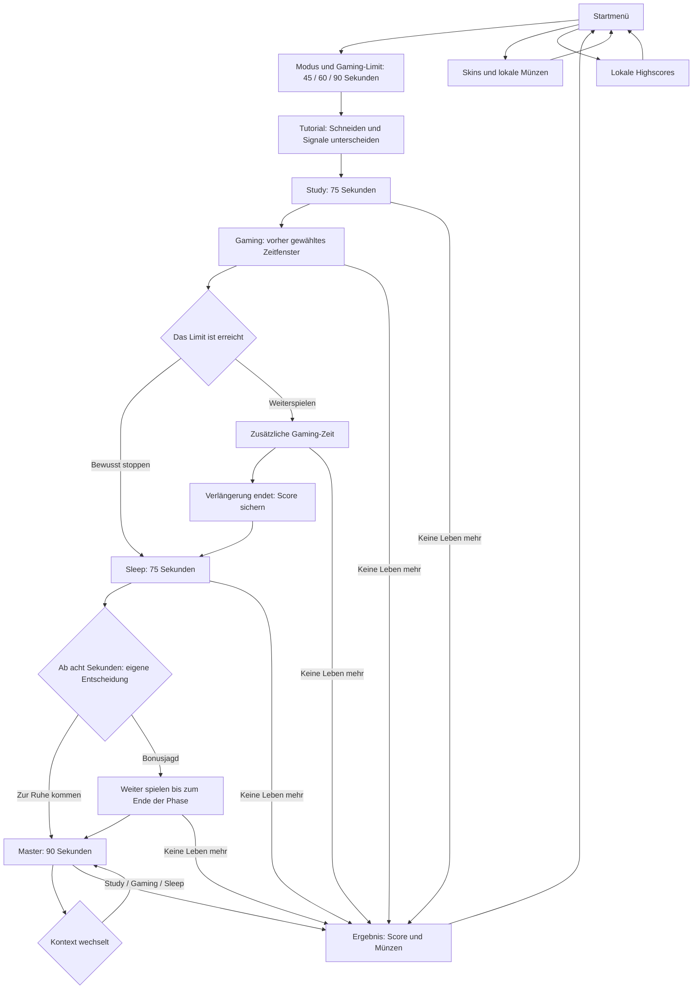
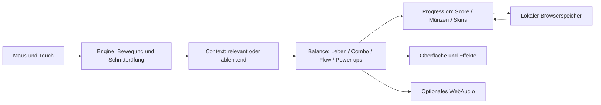
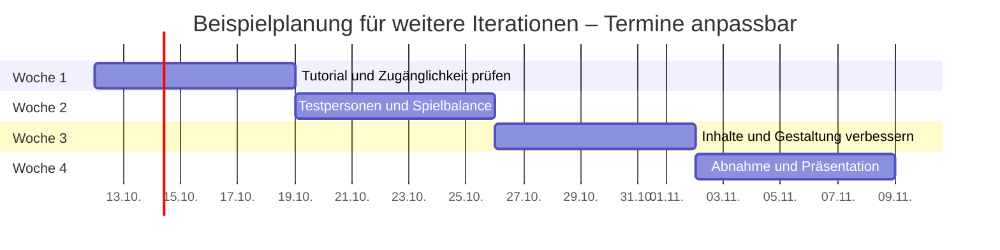

# Notification Ninja: Ablauf und Weiterentwicklung

Diese Übersicht dokumentiert den Spielablauf und ordnet die technischen Aufgaben. Der Zeitplan am Ende ist ein **anpassbares Beispiel für Weiterentwicklung**. Seine Daten sind keine vereinbarte Projektfrist.

## Ablauf der Bildschirme

Die Phase bestimmt, welche Nachrichten helfen und welche ablenken. Gaming- und Schlafentscheidungen werden über sichtbare Schaltflächen getroffen. Pause unterbricht die laufende Simulation; Musik wird dabei ebenfalls angehalten.

## Vier technische Systeme

| System | Aufgabe | Prüffrage |
| --- | --- | --- |
| Engine | Nachrichten bewegen, Wischsegmente erfassen und Treffer bestimmen | Schneidet die tatsächliche Bewegung die Nachricht, auch bei schnellen Wischbewegungen? |
| Context | Nachrichten im aktuellen Lern-, Gaming- oder Schlafkontext bewerten | Ändert sich die Bewertung derselben Nachricht beim Kontextwechsel? |
| Balance | Leben, Combo, Flow, Power-ups und Zeitentscheidungen berechnen | Bleiben Effekte zeitlich begrenzt und Entscheidungen wirksam? |
| Progression | Score, Münzen, Skins und Highscores lokal verwalten | Werden Belohnungen korrekt vergeben und nach erneutem Öffnen wiederhergestellt? |

Spielregeln werden getrennt von Darstellung und Eingaben überprüft. Die Audio-Komponente erzeugt Musik und Effekte lokal, bleibt standardmäßig aus und öffnet ihren AudioContext erst nach einer Nutzeraktion. Ihre Stimmenzahl ist begrenzt; Pause stoppt geplante Musiknoten.

## Beispiel für Weiterentwicklung: vier Wochen

Die vorhandene Grundlage umfasst Spielablauf, Kontextregeln, Fortschritt, Oberfläche und lokale Paketierung. Der folgende Plan zeigt mögliche nächste Iterationen auf dieser Grundlage. Beginn und Umfang lassen sich an einen tatsächlichen Semesterplan anpassen.

| Woche | Fokus | Reviewbares Ergebnis |
| --- | --- | --- |
| 1 | Verständlichkeit und Zugänglichkeit | Feedback zu Tutorial, Symbolen, Kontrasten und Bedienung; priorisierte Verbesserungen |
| 2 | Spielbalance mit Testpersonen | Nachvollziehbare Anpassungen an Spawnrate, Leben, Combo und Zeitfenstern |
| 3 | Inhalte und Gestaltung | Zusätzliche Nachrichten, Skins und audiovisuelle Varianten nach Tests |
| 4 | Abnahme und Präsentation | Geprüfter Browser-Build, vollständiges ZIP und dokumentierte Demonstration |

Pro Iteration: konkrete Änderung festlegen, Regeln prüfen, Browser- und Touch-Bedienung überprüfen, neu bauen und paketieren und anschließend das Ergebnis gemeinsam bewerten. Die Zeitplanblöcke beschreiben mögliche zukünftige Arbeit; sie behaupten keine bereits durchgeführten Nutzertests.
